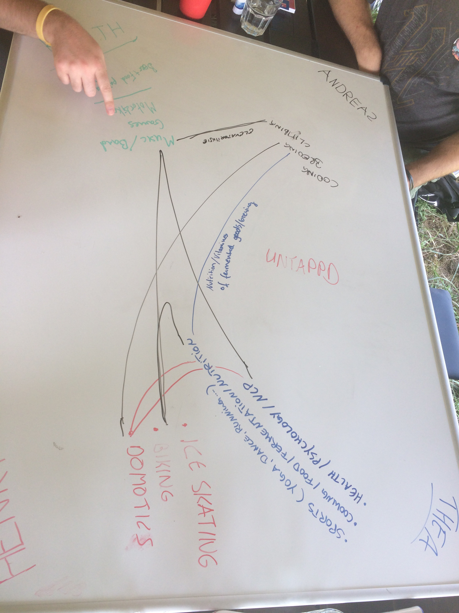
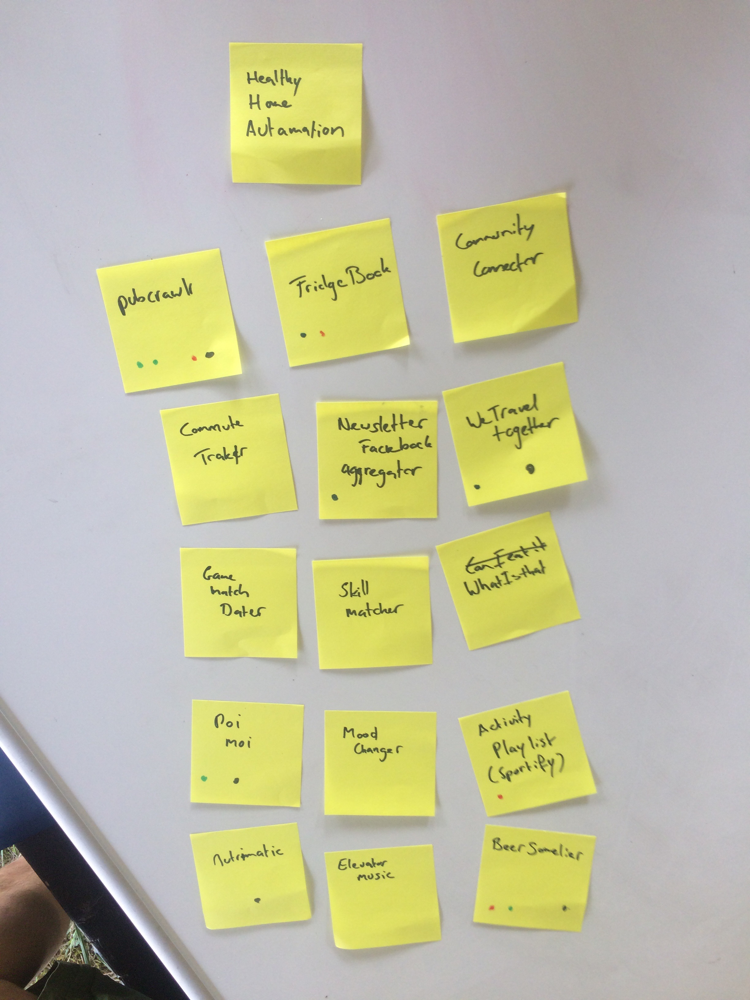
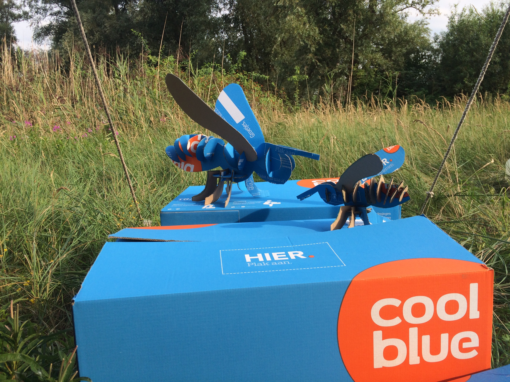
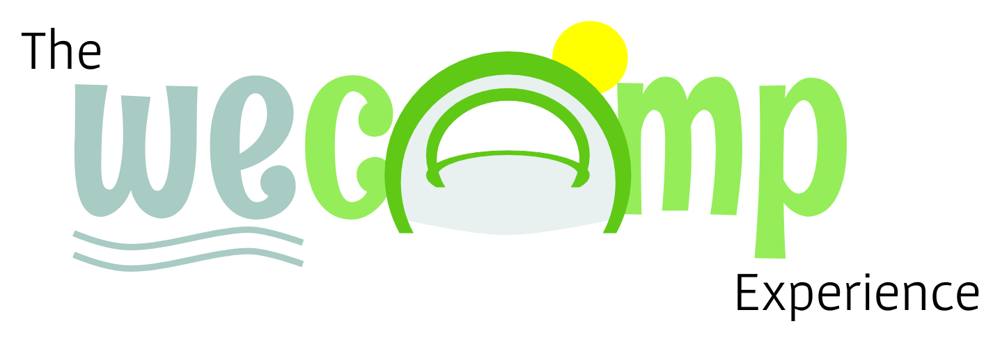

# Team SWA(S)P

* Thea 
* Henri
* Keith
* Andreas

# What we came here for

* Learn new stuff 
* Good opportunity to get out of comfort zone
* Exchange of ideas, ways of working 
* Getting out of my "bubble"
* Having time to dive into new tech

# Brainstorming

 

# Resulting ideas

# Project

> Allow flight-passengers to swap seats for more comfort

# Project

> 

# Approach

## discussed and modeled domain

## Decided on tech

* Frontend/API
* React for the frontend
* BEAR.sunday for the API

## Live-Demo

# What we've learned

* Seeing a product evolve from the beginning
* Realizing that others know as little as I do
* Sometimes you need trial and error
* Different ways to do brainstorming
* Don't fear an empty space
* Think about and elaborate on an idea before coding
* Get to know the domain before picking tech
* It's hard to realign to new ideas and ways of thinking
* Realizing that something goes wrong is a good thing
* Stepping back helps
* PairProgramming
* Standups - Retros

# One more thing

# Thank you

